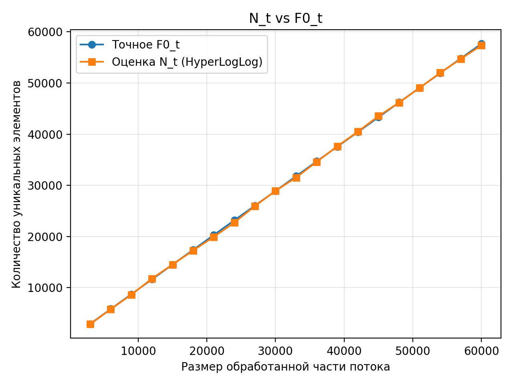
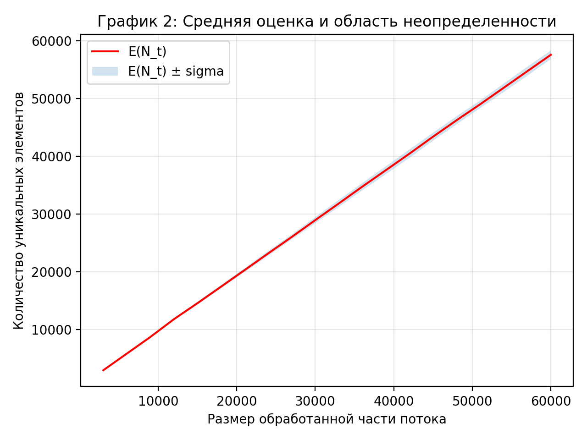

Сделано Бюрчиевым Тимуром БПИ 248

## Структура проекта

- `infrastructure/`
  - `RandomStreamGen.{h,cpp}` — генерация потока строк длины `1..30` из алфавита `[a-zA-Z0-9-]`
  - `HashFuncGen.{h,cpp}` — генерация хеш-функции `h: U → 2^32`
- `hll/`
  - `HyperLogLog.{h,cpp}` — реализация стандартного HyperLogLog
- `experiments/`
  - `OnlineStats.h` — оценка среднего и стандартного отклонения
- `results/`
  - `single_run.csv` — данные одного прогона (точное `F0(t)` и оценка `N_t`)
  - `multi_run.csv` — статистики по нескольким потокам (`E(N_t)`, `σ(N_t)`, `bias`)
  - `plot1_single_run.png`, `plot2_multi_run_mean_sigma.png` — итоговые графики
- `main.cpp` — генерация CSV (один прогон + несколько потоков)

---

## Инфраструктура

### Генерация потока

Реализован `RandomStreamGen`:

* генерирует поток длины `n` из строк длиной `1..30`
* алфавит: `A–Z`, `a–z`, `0–9`, `-`
* поток разбивается на “моменты времени” `t` через префиксы (шаг по процентам)

### Хеш-функция

Реализован `HashFuncGen`:

* pre-hash строк: FNV-1a 64-bit
* затем полиномиальное преобразование со случайными коэффициентами по модулю простого `P > 2^32`

---

## Этап 2. Точность стандартного HyperLogLog

Параметры эксперимента (текущая конфигурация):

* размер потока: `n = 60000`
* шаг checkpoints: `5%` (т.е. `t = 3000, 6000, ..., 60000`)
* HyperLogLog: `B = 12`, `m = 2^B = 4096`
* число потоков для статистики: `30`

Для каждого checkpoint `t` вычисляются:

* точное `F0(t)` (через множество уникальных элементов)
* оценка `N_t` (HyperLogLog)
* по нескольким потокам: `E(N_t)` и `σ(N_t)`

Сформированы два графика:

1. **График 1: `N_t` vs точное `F0(t)` (один прогон)**
   На графике видно, что оценка HLL практически совпадает с точным значением, то есть алгоритм даёт точные оценки при существенно меньших затратах памяти.
2. **График 2: `E(N_t)` и область `E(N_t) ± σ(N_t)` (по всем потокам)**
   Область неопределенности узкая; абсолютная ширина растёт при увеличении `t`, но остаётся небольшой относительно масштаба оценок.

---

## Этап 3. Анализ (для B = 12, m = 4096)

### Теоретические ориентиры

Для `B=12`:

* `sqrt(1.04 / 2^B) ≈ 1.59%`
* `sqrt(1.3  / 2^B) ≈ 1.78%`

### Эмпирические результаты (по всем checkpoints)

* `avg |bias| ≈ 0.179%`
* `max |bias| ≈ 1.262%` (на `t = 12000`)
* `avg rel_sigma = σ(N_t)/E(N_t) ≈ 1.62%`
* `max rel_sigma ≈ 1.92%`

**Вывод по точности:** смещение мало (в среднем доли процента), т.е. систематического завышения/занижения практически нет.
**Вывод по дисперсии:** относительный разброс `σ/E(N_t)` в среднем близок к теоретическому ориентиру `≈ 1.6–1.8%`; максимальное значение слегка превышает 1.78%, что возможно из-за конечного числа прогонов (30).

## Параметры и влияние констант

* `B` напрямую задаёт компромисс память/точность: `m = 2^B`, а относительная ошибка убывает примерно как `1/√m`.
* Для корректной работы HLL важно качественное хеширование; в проекте используется pre-hash (FNV-1a) + полиномиальное преобразование со случайными коэффициентами, что даёт близкое к равномерному распределение значений хеша.
